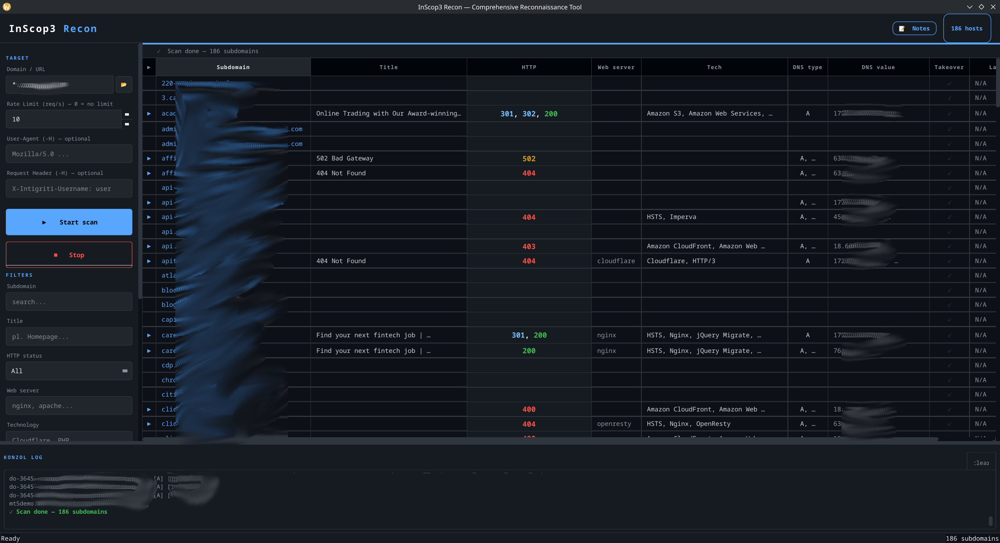
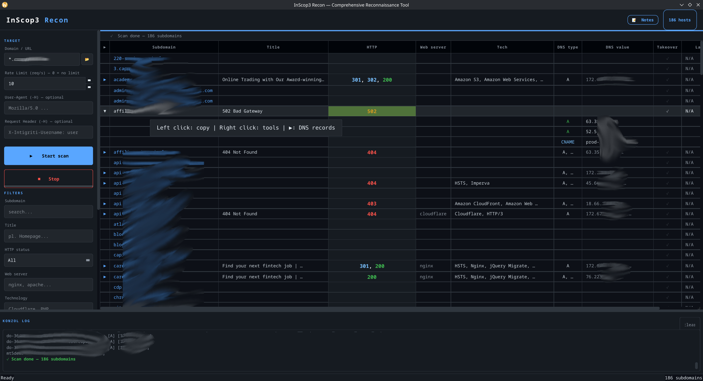
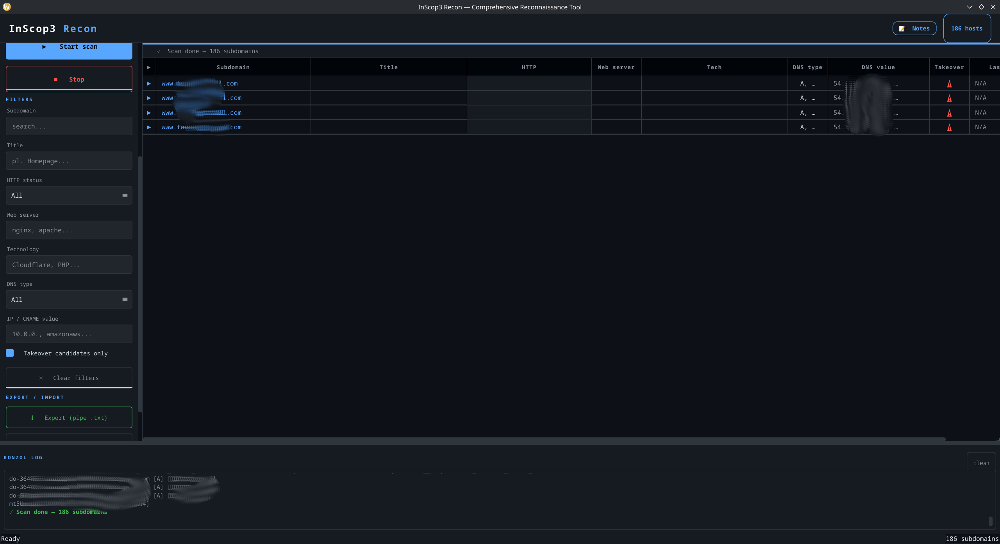
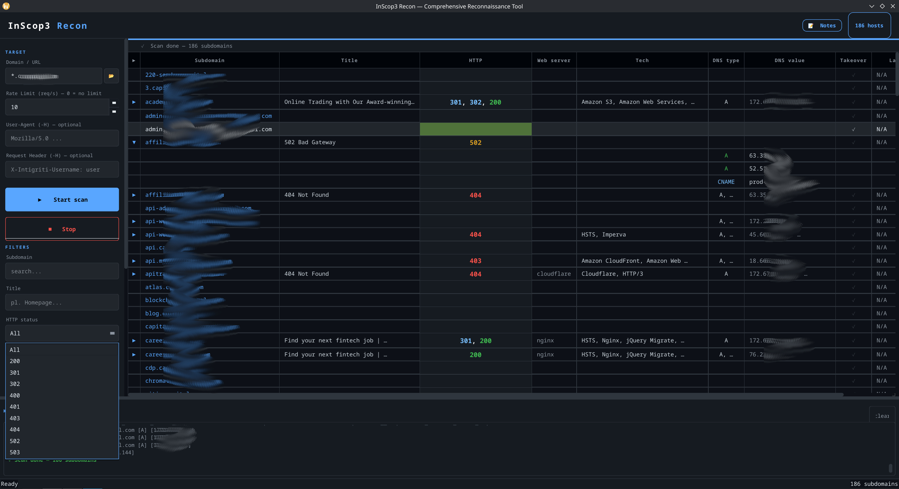
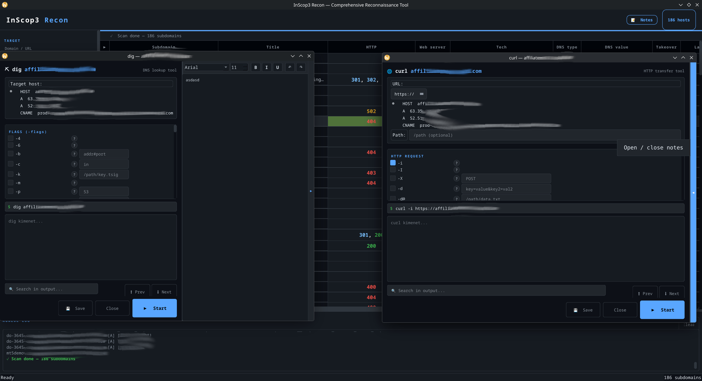
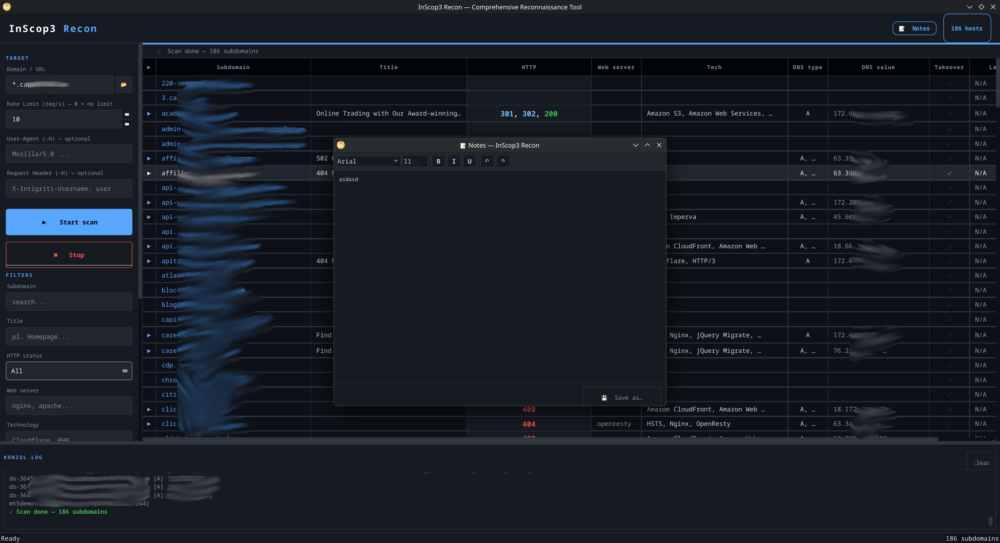
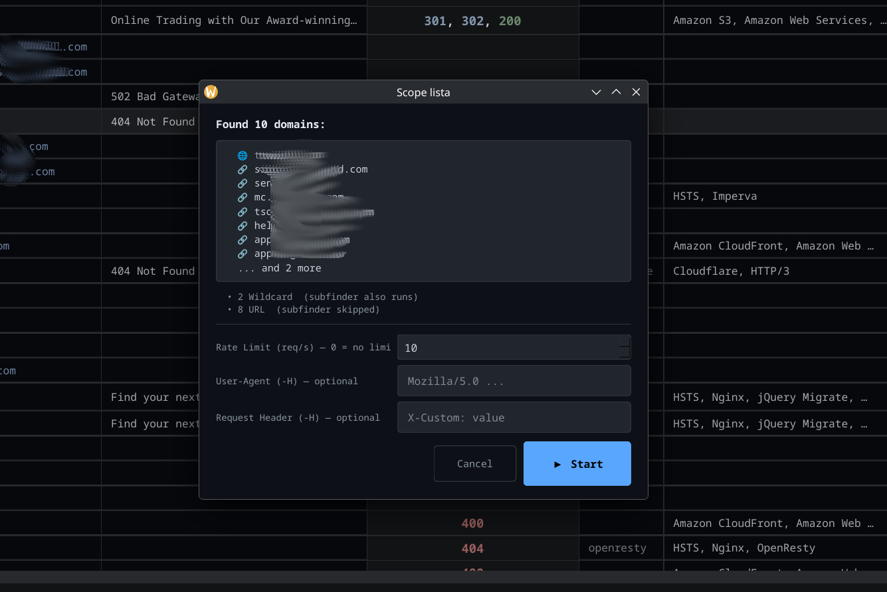
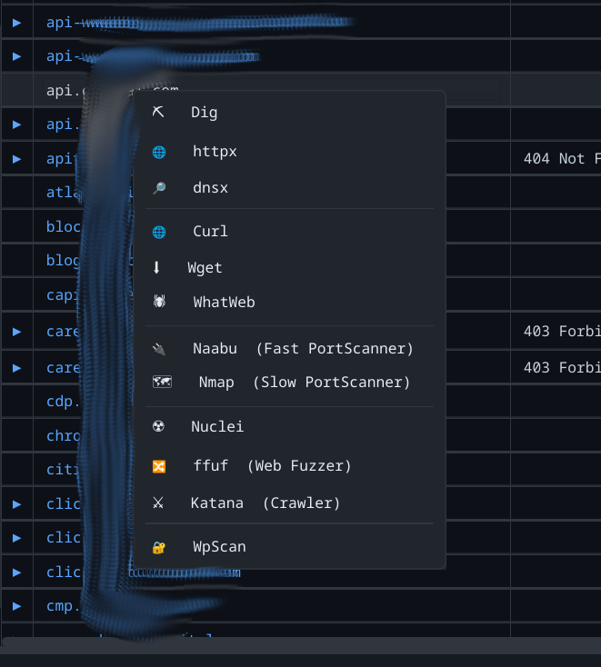

<div align="center">


<!--  -->

# InScop3 Recon

**Comprehensive Reconnaissance Tool for Bug Bounty & Penetration Testing**

[](https://python.org)
[](https://riverbankcomputing.com/software/pyqt/)
[](LICENSE)
[](https://kernel.org)
[](https://projectdiscovery.io)
[]()

</div>

---

## What is InScop3?

**InScop3 Recon** is a graphical reconnaissance framework built with Python and PyQt6. It ties together a suite of industry-standard command-line security tools under a single, clean interface — so you can go from a domain name to a full picture of its attack surface without jumping between terminals.

It is designed for bug bounty hunters, penetration testers, and security researchers who want fast, organised, and repeatable recon workflows.

**The tool is bilingual** — the UI is fully available in both English and Hungarian, selectable at startup.

---

## Features

- **Subdomain enumeration** via `subfinder` with passive and active source support
- **HTTP probing** with `httpx` — live host detection, status codes, titles, web server and technology fingerprinting
- **DNS resolution** with `dnsx` — A, AAAA, CNAME, MX records per subdomain
- **Port scanning** via `naabu` — fast SYN/CONNECT scan with configurable rate limiting
- **Vulnerability scanning** with `nuclei` — template-based CVE and misconfiguration detection
- **Web server fingerprinting** via `whatweb` — identifies technologies, frameworks, CMS
- **WordPress scanning** via `wpscan` — plugin/theme vulnerabilities, user enumeration
- **DNS lookups** with `dig` — manual queries with full flag control
- **Network scanning** with `nmap` — the classic, with full flag support in the UI
- **HTTP client tabs** for `curl` and `wget` — run requests directly from the interface
- **Subdomain takeover detection** — flags NXDOMAIN entries that are potential takeover candidates
- **Batch scanning** — import a scope list and scan multiple domains sequentially
- **Results table** with live filtering by subdomain, HTTP status, web server, technology, DNS type, IP/CNAME value, and takeover flag
- **Export** — save results as pipe-separated `.txt` files
- **Built-in Notes editor** — formatted notes (bold, italic, underline), font control, undo/redo, save-as; starts empty on every launch
- **Direct URL mode** — skip subfinder and probe a target directly (useful for IPs or specific endpoints)
- **Root flag** — optionally run `subfinder -all` for broader enumeration (requires sudo)
- **Editable commands** — every tool command is shown and editable before running
- **Custom User-Agent and request headers** — applies to httpx and other HTTP tools

---

## Integrated Tools

| Tool | Purpose |
|------|---------|
| `subfinder` | Passive + active subdomain enumeration |
| `httpx` | HTTP probing, tech detection, status codes |
| `dnsx` | DNS resolution (A, AAAA, CNAME, MX, …) |
| `naabu` | Fast port scanner |
| `nuclei` | Template-based vulnerability scanner |
| `whatweb` | Web server and technology fingerprinting |
| `wpscan` | WordPress vulnerability scanner |
| `dig` | Manual DNS queries |
| `nmap` | Network and port scanner |
| `curl` | HTTP client |
| `wget` | File and page downloader |

---

## Screenshots










<!-- After adding screenshots to the assets/ folder, uncomment these lines: -->
<!--  -->
<!--  -->

---

## Requirements

- Linux (Arch, Debian/Ubuntu, Fedora/RHEL, openSUSE, Kali, Parrot — see installer)
- Python 3.8 or newer
- Go 1.18 or newer (for ProjectDiscovery tools)
- Internet connection during installation

---

## Installation

### Option A — Automated installer (recommended)

Clone the repository and run the installer:

```bash
git clone https://github.com/yourusername/inscop3.git
cd inscop3
chmod +x install_inscop3.sh
./install_inscop3.sh
```

The installer handles everything automatically:

1. Updates package lists
2. Installs system dependencies (Python, Go, nmap, curl, wget, ruby, dnsutils)
3. Installs PyQt6 — tries the system package first; falls back to pip only if needed
4. Adds Go binaries to `$PATH` in `.bashrc`, `.zshrc`, `.profile`, and fish config
5. Installs ProjectDiscovery tools (`subfinder`, `httpx`, `dnsx`, `naabu`, `nuclei`)
6. Installs `whatweb` and `wpscan`
7. Copies `inscop3.py` to `~/.local/share/inscop3/`
8. Creates the `inscop3` launcher in `~/.local/bin/`
9. Creates a desktop entry so InScop3 appears in your application menu

After the installer finishes, reload your shell:

```bash
source ~/.bashrc    # or source ~/.zshrc
```

Then launch:

```bash
inscop3
```

---

### Option B — Manual installation

If you prefer to install everything yourself:

**1. System packages**

Debian / Ubuntu / Kali:
```bash
sudo apt-get update
sudo apt-get install -y python3 python3-pip golang nmap curl wget ruby ruby-rdoc dnsutils
```

Arch / Manjaro:
```bash
sudo pacman -S --needed python python-pip go nmap curl wget ruby bind
```

Fedora / RHEL:
```bash
sudo dnf install -y python3 python3-pip golang nmap curl wget ruby ruby-doc bind-utils
```

**2. PyQt6**

Try the system package first:
```bash
# Debian/Ubuntu/Kali:
sudo apt-get install -y python3-pyqt6

# Arch:
sudo pacman -S python-pyqt6

# Fedora:
sudo dnf install python3-PyQt6
```

If the system package is not available:
```bash
pip install PyQt6 --break-system-packages
```

**3. Go PATH**

```bash
export GOPATH="$HOME/go"
export PATH="$PATH:$GOPATH/bin"
echo 'export GOPATH="$HOME/go"' >> ~/.bashrc
echo 'export PATH="$PATH:$GOPATH/bin"' >> ~/.bashrc
source ~/.bashrc
```

**4. ProjectDiscovery tools**

```bash
go install github.com/projectdiscovery/subfinder/v2/cmd/subfinder@latest
go install github.com/projectdiscovery/httpx/cmd/httpx@latest
go install github.com/projectdiscovery/dnsx/cmd/dnsx@latest
go install github.com/projectdiscovery/naabu/v2/cmd/naabu@latest
go install github.com/projectdiscovery/nuclei/v3/cmd/nuclei@latest
```

**5. WhatWeb and WpScan**

```bash
gem install whatweb wpscan
```

**6. InScop3 itself**

```bash
mkdir -p ~/.local/share/inscop3 ~/.local/bin
cp inscop3.py ~/.local/share/inscop3/

cat > ~/.local/bin/inscop3 << 'EOF'
#!/usr/bin/env bash
export GOPATH="$HOME/go"
export PATH="$PATH:$GOPATH/bin:$HOME/.local/bin"
exec python3 "$HOME/.local/share/inscop3/inscop3.py" "$@"
EOF
chmod +x ~/.local/bin/inscop3

echo 'export PATH="$PATH:$HOME/.local/bin"' >> ~/.bashrc
source ~/.bashrc
```

Or simply run directly from the project folder:

```bash
python3 inscop3.py
```

---

## Usage

### Starting the program

```bash
inscop3
```

Or directly:

```bash
python3 ~/.local/share/inscop3/inscop3.py
```

At startup, choose your language: **English** or **Hungarian**.

---

### Basic workflow

1. Type a domain into the **Target host** field (e.g. `example.com`)
2. Optionally set a rate limit, User-Agent, or custom request header
3. Click **▶ Start** — subfinder runs first, then httpx and dnsx probe each result
4. Watch the results populate the table in real time
5. Use the **FILTERS** section to narrow down results
6. Click any row to open it; right-click for tool options (httpx, dnsx, naabu, nuclei, whatweb, wpscan, nmap, curl, wget, dig)
7. Click **⬇ Export (pipe .txt)** to save the results
8. Use the **📝 Notes** button to document your findings

---

### Scan modes

**Standard mode** — enter a domain like `example.com`. Subfinder enumerates subdomains, then each is probed with httpx and dnsx.

**Direct URL mode** — check the *Direct URL* toggle to skip subfinder and probe the target directly. Useful for IP addresses, internal hosts, or specific endpoints.

**Batch mode** — import a scope file (one domain per line) using the scope import button. InScop3 processes all domains in sequence and merges the results into one table.

**Root flag** — enabling this runs `subfinder -all` for broader enumeration. It may prompt for your sudo password.

---

### Results table columns

| Column | Description |
|--------|-------------|
| Subdomain | Enumerated hostname |
| Title | HTTP page title |
| HTTP Status | Response code (colour coded) |
| Web Server | Detected web server (nginx, Apache, IIS, …) |
| Technology | Detected technologies (PHP, WordPress, Cloudflare, …) |
| DNS Type | Record type (A, AAAA, CNAME, MX, …) |
| DNS Value | IP address or CNAME target |
| Takeover | ⚠ if NXDOMAIN — potential subdomain takeover candidate |
| Last Modified | Last-Modified HTTP header value |

---

### Filters

The **FILTERS** panel lets you narrow results without re-running a scan:

- **Subdomain** — free-text search
- **HTTP Status** — dropdown (All / 200 / 301 / 302 / 403 / 404 / 500 / …)
- **Web Server** — free-text (nginx, Apache, …)
- **Technology** — free-text (PHP, WordPress, Cloudflare, …)
- **DNS Type** — dropdown (All / A / AAAA / CNAME / MX / …)
- **IP / CNAME value** — free-text
- **Takeover candidates only** — checkbox to show only NXDOMAIN entries

---

### Tool tabs

Right-clicking a row in the results table opens individual tool dialogs. Each dialog shows the exact command that will be run and lets you edit flags and options before executing:

- **httpx** — additional HTTP probing with full flag support
- **dnsx** — DNS resolution with record type and query options
- **naabu** — port scan the selected host
- **nuclei** — vulnerability scan with template selection
- **whatweb** — fingerprint the web server and technologies
- **wpscan** — WordPress vulnerability and user enumeration scan
- **nmap** — full network scan with script support
- **curl** — manual HTTP request
- **wget** — download pages or files
- **dig** — manual DNS query

---

### Notes

The **📝 Notes** button opens a floating notes window. It supports bold, italic, and underline formatting, font family and size selection, and undo/redo. Notes can be saved to a custom file location with **💾 Save as…**

Notes start empty every time you launch InScop3. They are not pre-loaded from the previous session.

---

### Keyboard shortcuts

| Shortcut | Action |
|----------|--------|
| `Ctrl+Z` | Undo (Notes editor) |
| `Ctrl+Y` | Redo (Notes editor) |
| `Ctrl+A` | Select all |
| `Ctrl+C` | Copy selected text |

---

## Updating

To update InScop3 to a newer version, copy the new `inscop3.py` over the installed one:

```bash
cp inscop3.py ~/.local/share/inscop3/inscop3.py
```

To update the ProjectDiscovery tools:

```bash
go install github.com/projectdiscovery/subfinder/v2/cmd/subfinder@latest
go install github.com/projectdiscovery/httpx/cmd/httpx@latest
go install github.com/projectdiscovery/dnsx/cmd/dnsx@latest
go install github.com/projectdiscovery/naabu/v2/cmd/naabu@latest
go install github.com/projectdiscovery/nuclei/v3/cmd/nuclei@latest
```

---

## Troubleshooting

**`inscop3`: command not found**
```bash
source ~/.bashrc    # or open a new terminal
```

**PyQt6 import error**
```bash
pip install PyQt6 --break-system-packages
```

**subfinder / httpx / dnsx not found**
```bash
echo $GOPATH          # should be $HOME/go
ls $GOPATH/bin/       # tools should be listed here
source ~/.bashrc
```

If the tools are missing from `$GOPATH/bin`, re-run the relevant `go install` command.

**WhatWeb or WpScan not found**
```bash
sudo apt-get install -y ruby ruby-dev    # or equivalent for your distro
gem install whatweb wpscan
```

**nuclei templates missing on first run**

Nuclei downloads its templates automatically on the first execution. This requires an internet connection and may take a moment.

---

## File layout

```
inscop3/
├── inscop3.py            Main application
├── install_inscop3.sh    Automated installer
├── inscop3.sh            Direct launcher (run from project folder)
├── README.md
├── LICENSE
└── assets/               Put your logo and screenshots here
    └── logo.png
```

Installed locations:

```
~/.local/share/inscop3/   Application files
~/.local/bin/inscop3      Launcher script
~/.local/share/applications/inscop3.desktop   Desktop entry
```

---

## Legal

InScop3 is intended for use on systems and domains you own or have explicit written permission to test. Unauthorised scanning is illegal in most jurisdictions. The author takes no responsibility for misuse.

---

## Contributing

Pull requests are welcome. For significant changes, open an issue first to discuss what you would like to change.

---

## License

This software is free to use for personal, educational, and professional purposes.  
**Modification, commercial use, and redistribution under a different name are not permitted.**  
See the [LICENSE](LICENSE) file for the full terms.

---

<div align="center">

Copyright (c) 2026 Ádám Horváth. All Rights Reserved.

</div>
